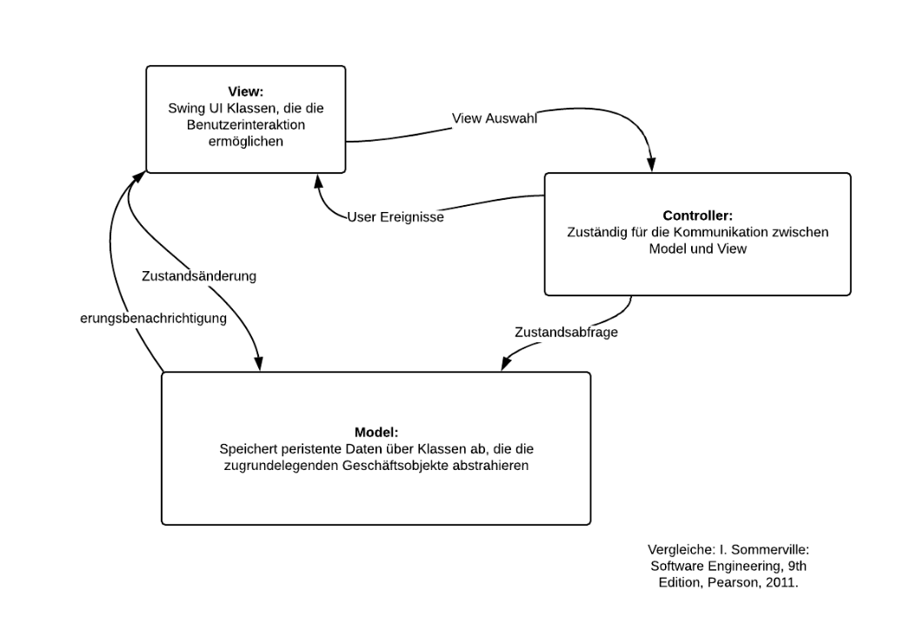
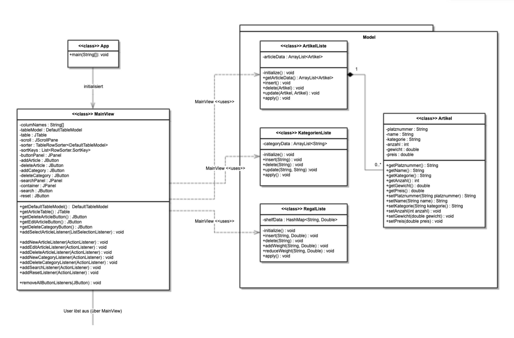
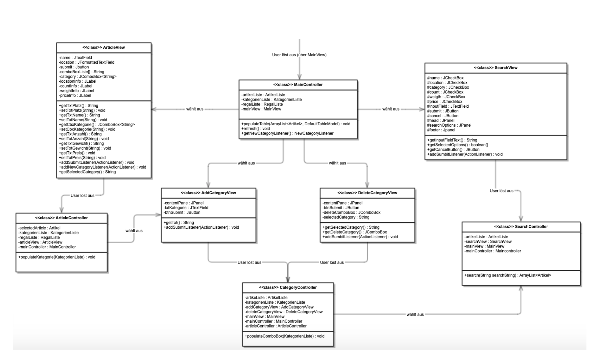

## Description

A simple inventory desktop app. Built with Java Swing. To test it, please clone the repository, open the project in Eclispe and run the 'App' class. It it possible to add, delete and edit items and categories, as well as search for a specific item.

## Design

We used MVC to design the app:

### Class diagrams:

